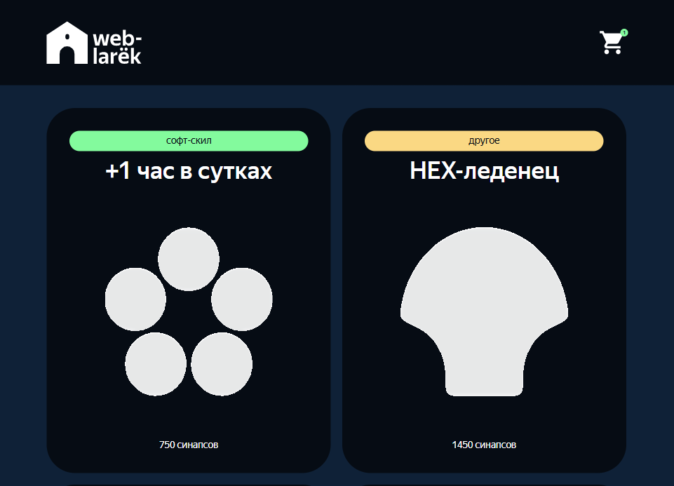

# Интернет магазин "Веб-ларек"

"Веб-ларек" - это проект интернет-магазина с товарами. В нём можно посмотреть каталог товаров, добавить товары в корзину и сделать заказ.



## Стек

      

## Особенности реализации

- Подготовлено описание архитектуры приложения (ниже по тексту) и объявлены типы данных до реализации проекта
- Интерфейс разработан на TypeScript, интеграция с API
- Код приложения разделен на слои согласно парадигме MVP

## Установка и запуск

Для установки и запуска проекта необходимо выполнить команды

```
npm install
npm run start
```

или

```
yarn
yarn start
```

## Данные и типы данных, используемые в приложении

Карточка товара

```
interface IItem {
	id: string;
	title: string;
	image: string;
	category: string;
	price: number | null;
	description: string;
}
```

Пользователь

```
interface ICustomer {
	payment: 'card' | 'cash' | '';
	address: string;
	email: string;
	phone: string;
}
```

Данные пользователя, используемые при валидации форм

```
type FormErrors = Partial<Record<keyof ICustomer, string>>;
```

Тип данных, используемых для отправки заказа на сервер

```
type IOrder = ICustomer & { total: number; items: string[] };
```

Тип данных, которые возвращает сервер при успешном подтверждении заказа

```
type IOrderSuccess = { id: string; total: number };
```

## Архитектура приложения

Код приложения разделен на слои согласно парадигме MVP:

- слой представления - отвечает за отображение данных на странице,
- слой данных - отвечает за хранение и изменение данных,
- презентер - отвечает за связь представления и данных.

### Базовый код

#### Класс Api

Содержит в себе базовую логику отправки запросов. В конструктор передается базовый адрес сервера и опциональный объект с заголовками запросов.
Методы:

- `get` - выполняет GET запрос на переданный в параметрах ендпоинт и возвращает промис с объектом, которым ответил сервер
- `post` - принимает объект с данными, которые будут переданы в JSON в теле запроса, и отправляет эти данные на ендпоинт, переданный как параметр при вызове метода. По умолчанию выполняется `POST` запрос, но метод запроса может быть переопределен заданием третьего параметра при вызове.

#### Класс EventEmitter

Брокер событий позволяет отправлять события и подписываться на события, происходящие в системе. Класс используется в презентере для обработки событий и в слоях приложения для генерации событий.  
Основные методы, реализуемые классом описаны интерфейсом `IEvents`:

- `on` - подписка на событие
- `emit` - инициализация события
- `trigger` - возвращает функцию, при вызове которой инициализируется требуемое в параметрах событие

### Слой данных

#### Класс CatalogModel

Класс отвечает за хранение и логику работы с каталогом товаров.\
Конструктор класса принимает инстант брокера событий.\
В полях класса хранятся следующие данные:

- `catalog: IItem[]` - массив карточек товаров, т.е. каталог всех представленных товаров
- `item: IItem` - карточка товара, выбранного для просмотра в модальном окне
- `events: IEvents` - экземпляр класса `EventEmitter` для инициации событий при изменении данных

Так же класс предоставляет набор методов для взаимодействия с этими данными:

- `setCatalog(items: IItem[])` - сохраняет все карточки товаров в виде массива в классе
- `getCatalog(): IItem[]` - возвращает массив товаров, которые отображаются на сайте в каталоге товаров
- `setItem(item: IItem)` - сохраняет одну карточку
- `getItem(): IItem` - возвращает сохраненную карточку

#### Класс BasketModel

Класс отвечает за хранение и логику работы с корзиной товаров.\
Конструктор класса принимает инстант брокера событий.\
В полях класса хранятся следующие данные:

- `items: IItem[]` - массив товаров, добавленных в корзину
- `events: IEvents` - экземпляр класса `EventEmitter` для инициации событий при изменении данных

Так же класс предоставляет набор методов для взаимодействия с этими данными:

- `addItem(item: IItem)` - метод, который принимает карточку товара и добавляет этот товар в корзину в конец списка
- `deleteItem(id: 'string')` - метод, который по айди товара удаляет товар из корзины
- `getTotalAmount(): number` - метод возвращает количество товаров в корзине
- `getTotalCost(): number` - метод возвращает общую стоимость всех товаров в корзине
- `getBasket(): IItem[]` - метод возвращает массив товаров, добавленных в корзину
- `clearBasket()` - метод удаляет все товары из корзины
- `isInBasket(id: 'string'): boolean` - по айди товара проверяет, добавлен ли данный товар уже в корзину или нет

#### Класс CustomerModel

Класс отвечает за хранение и логику работы с данными текущего покупателя.\
Конструктор класса принимает инстант брокера событий.\
В полях класса хранятся следующие данные:

- `customer: ICustomer = {payment, address, email, phone}` - объект данных покупателя, который содержит информацию о покупателе и выбранный способ оплаты
- `formErrors: FormErrors` - объект, который содержит ошибки валидации форм
- `events: IEvents` - экземпляр класса `EventEmitter` для инициации событий при изменении данных

Так же класс предоставляет набор методов для взаимодействия с этими данными:

- `setOrderData(field: keyof ICustomer, value: string)` - метод сохраняет оплату и адрес в классе
- `setContactsData(field: keyof ICustomer, value: string)` - метод сохраняет имейл и телефон в классе
- `getCustomerData(): ICustomer` - метод возвращает данные пользователя
- `clearCustomerData(): void` - метод очищает данные пользователя и ошибки валидации
- `validateOrderData()` - метод проверяет введенные пользователем данные на валидность (оплату и адрес)
- `validateContactsData()` - метод проверяет введенные пользователем данные на валидность (имейл и телефон)

### Классы представления

Все классы представления отвечают за отображение внутри контейнера (DOM-элемент) передаваемых в них данных.

#### Базовый Класс Component

Класс является дженериком и родителем всех компонентов слоя представления. В дженерик принимает тип объекта, в котором данные будут передаваться в метод render для отображения данных в компоненте. В конструктор принимает элемент разметки, являющийся основным родительским контейнером компонента. Содержит метод render, отвечающий за сохранение полученных в параметре данных в полях компонентов через их сеттеры, возвращает обновленный контейнер компонента.

#### Класс Modal

Реализует модальное окно, наследует класс Component. Так же предоставляет методы `open` и `close` для управления отображением модального окна. Устанавливает слушатели на клавиатуру, для закрытия модального окна по Esc, на клик в оверлей и кнопку-крестик для закрытия попапа. Поля класса содержат элемент кнопки-крестика и элемент разметки, куда можно будет вставить контент для модального окна.

- `constructor(container: HTMLElement, events: IEvents)` Конструктор принимает контейнер и экземпляр класса `EventEmitter` для возможности инициации событий.

Методы:

- `render(data: IModal): HTMLElement` - расширяет родительский метод, вызывая открытие модального окна и устанавливает контент внутри модального окна.

#### Класс Page

Наследует класс Component. Реализует главную страницу, отвечает за отображение блока с карточками товаров на главной странице и за отображение счетчика товаров на иконке корзины. В конструктор принимает контейнер, в котором размещаются карточки, и брокер событий. Устанавливает слушатели на иконку корзины, для открытия модального окна с корзиной товаров.

Методы:

- `сеттер counter(value: number)` - устанавливает счетчик на иконку корзины
- `сеттер catalog(items: HTMLElement[])` - устанавливает каталог товаров на главную страницу
- `сеттер locked(value: boolean)` - блокирует и разблокирует прокрутку страницы во время открытия модалки

#### Класс Basket

Наследует класс Component. Реализует корзину товаров, отображает список товаров, итоговую сумму товаров. В конструктор принимает контейнер и брокер событий. Устанавливает слушатель на кнопку оформления заказа. В полях класса сохраняет информацию о заголовке корзины, список товаров, итоговую сумму заказа, кнопку оформления заказа.

Методы:

- `сеттер basketTitle(value: string)` - устанавливает заголовок
- `сеттер orderButton(value: string)` - устанавливает надпись на кнопку заказа и делает кнопку активной/неактивной
- `сеттер items(items: HTMLElement[])` - утсанавливает содержимое корзины (список товаров)
- `сеттер totalCost(value: number)` - устанавливает итоговую сумму заказа

#### Класс SuccessOrder

Наследует класс Component. Реализует окно подтверждения об успошном оформлении заказа и отображает итоговую сумму заказа. В конструктор принимает контейнер и брокер событий. Устанавливает слушатель на кнопку возвращения к каталогу. В полях класса сохраняет информацию о заголовке, итоговой сумме заказа, кнопке возвращения на главную страницу.

Методы:

- `сеттер title(value: string)` - устанавливает заголовок
- `сеттер text(value: number)` - устанавливает надпись с итоговой суммой заказа
- `сеттер button(value: string)` - устанавливает надпись на кнопке возвращения в каталог

#### Класс Card

Наследует класс Component, является общим классом для всех отображений карточки, что позволяет при необходимости формировать карточки разных вариантов верстки. Задает заголовок и цену товара, сохраняет айди карточки и задает необязательные поля - картинка, категория, описание.
Конструктор, кроме темплейта принимает экземпляр `EventEmitter` для инициации событий.\

Методы:

- `render(data: Partial<T> & Partial<IItem>)` - устанавливает отдельно заголовок и цену товара, остальные данные являются необязательными и рендерятся при необходимости
- `get title(): string` - возвращает заголовок товара для установки альтернативного текста у картинки
- `get price(): number | null` - возвращает цену товара для смены надписи на кнопках
- `get id(): string` - возвращает айди карточки

#### Класс CardCatalog

Наследует класс Card и отвечает за отображение карточки товара в каталоге на главной странице. В конструктор принимает темплейт и обработчик, который передается для открытия превью карточки при клике на нее в каталоге.

#### Класс CardPreview

Наследует класс Card и отвечает за отображение превью карточки товара в модальном окне. Расширяет родительский класс и сохраняет в полях кнопку покупки товара и свойство, определяющее лежит товар уже в корзине или нет. В конструктор принимает темплейт и обработчик, который передается для добавления/удаления товара из корзины.
Методы:

- `сеттер buttonText(value: boolean)` - меняет надпись на кнопке покупки товара в зависимости от того, есть цена на товар или нет и лежит товар в корзине или нет.

#### Класс CardBasket

Наследует класс Card и отвечает за отображение карточки товара в корзине. Расширяет родительский класс и сохраняет в полях кнопку удаления товара из корзины и порядковый номер товара в корзине. В конструктор принимает темплейт и обработчик, который передается для удаления товара из корзины.
Методы:

- `сеттер index(value: number)` - устанавливает порядковый номер товара в корзине

#### Класс Form

Общий класс для форм, наследует Component. Предназначен для реализации форм оформления заказа. В конструкторе устанавливает слушатели на все поля ввода в форме и устанавливает слушатель на кнопку сабмита. При изменении данных в полях ввода инициирует событие изменения данных. Предоставляет методы для отображения ошибок и управления активностью кнопки сабмита.
Поля класса:

- `_titles: HTMLElement[]` - массив с заголовками для полей формы
- `_submitButton: HTMLButtonElement` - кнопка подтверждения
- `_errors: HTMLElement` - массив с ошибками валидации

Методы:

- `сеттер titles(value: string[])` - устанавливает заголовки для разных полей ввода
- `сеттер button(value: string)` - устанавливает надпись на кнопку сабмита
- `сеттер valid(value: boolean)` - устанавливает состояние валидности формы
- `сеттер errors(value: string)` - устанавливает тексты ошибок в форму

#### Класс FormOrder

Расширяет класс Form. Предназначен для реализации формы, содержащей методы оплаты и адрес. В конструкторе устанавливает слушатель на кнопки выбора метода оплаты.

Методы:

- `сеттер paymentButtons(value: string[])` - устанавливает тексты на кнопки выбора метода оплаты
- `сеттер address(value: string)` - устанавливает значение введенного клиентом адреса
- `сеттер payment(value: 'card' | 'cash')` - устанавливает выбранный метод оплаты и выделяет выбранную кнопку

#### Класс FormContact

Расширяет класс Form. Предназначен для реализации формы, содержащей имейл и телефон. Сохраняет введенные пользователем данные.
Методы:

- `сеттер email(value: string)` - устанавливает значение введенного клиентом имейла
- `сеттер phone(value: string)` - устанавливает значение введенного клиентом телефона

### Слой коммуникации

#### Класс AppApi

Принимает в конструктор экземпляр класса Api и предоставляет методы реализующие взаимодействие с бэкендом сервиса.

## Взаимодействие компонентов

Код, описывающий взаимодействие представления и данных между собой находится в файле `index.ts`, выполняющем роль презентера.\
Взаимодействие осуществляется за счет событий, генерируемых с помощью брокера событий, и обработчиков этих событий, описанных в `index.ts`\
В `index.ts` сначала создаются экземпляры всех необходимых классов, а затем настраивается обработка событий.

_Список всех событий, которые могут генерироваться в системе:_\
_События изменения данных (генерируются классами моделей данных)_

- `catalog:changed` - изменение каталога товаров
- `basket:changed` - изменение корзины с товарами

_События, возникающие при взаимодействии пользователя с интерфейсом (генерируются классами, отвечающими за представление)_

- `basket:open` - открытие модального окна с корзиной товаров
- `card:select` - открытие выбранной карточки в модальном окне с подробным описанием товара
- `card:buy` - добавление выбранного товара в корзину или удаление из корзины, если товар уже в корзине
- `basket:delete` - удаление выбранного товара из корзины
- `order:open` - событие, сообщающее о переходе к оформлению заказа
- `order:submit` - событие, генерируемое при подтверждении адреса и выборе оплаты и переход к странице с контактными данными
- `contacts:submit` - событие, генерируемое при подтверждении имэйла и телефона
- `modal:open` - открытие модального окна
- `modal:close` - закрытие модального окна
- `order.card:selected` - событие, генерируемое при выборе оплаты картой
- `order.cash:selected` - событие, генерируемое при выборе оплаты наличными
- `order.address:change` - событие, генерируемое при вводе данных в поле адреса
- `contacts.email:change` - событие, генерируемое при вводе данных в поле имэйла
- `contacts.phone:change` - событие, генерируемое при вводе данных в поле телефона
- `formErrors.order:change` - событие, генерируемое для валидации формы заказа
- `formErrors.contacts:change` - событие, генерируемое для валидации формы с контактами
- `order.success` - событие, сообщающее об успешном оформлении заказа
